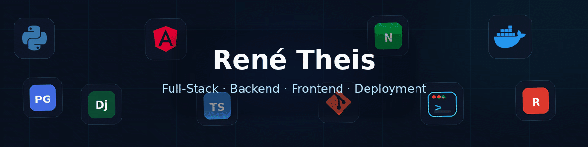

<p align="center">
  
</p>

<p align="center">
  <a href="https://rene-theis.de">
    
  </a>
  
  
</p>

---

## Über mich

> **Ich entwickle Anwendungen nicht nur bis `localhost`.**

Ich bin Full-Stack-Entwickler mit Schwerpunkt auf **Python, Django und REST-APIs im Backend** sowie **Angular und TypeScript im Frontend**.

Dabei interessiert mich der komplette Weg einer Anwendung: von Benutzeroberfläche und API über Datenbank und Hintergrundprozesse bis zu **Docker, Linux, Nginx, HTTPS und produktivem Betrieb**.

Saubere Architektur, wartbarer Code und Lösungen mit echtem praktischem Nutzen stehen für mich im Vordergrund.

```yaml
entwickler:
  name: "René Theis"
  rolle: "Full-Stack-Entwickler"
  schwerpunkte:
    - "Backend & REST-APIs"
    - "Full-Stack-Webanwendungen"
    - "Deployment & Infrastruktur"
    - "KI-gestützte Automatisierung"
  arbeitsweise:
    - "strukturiert"
    - "lösungsorientiert"
    - "qualitätsbewusst"
  perspektive: "DevSecOps"
```

## Tech-Stack

<p align="center">
  
</p>

<p align="center">
  
  
  
  
  
</p>

---

## Ausgewählte Projekte

<table>
<tr>
<td width="50%" valign="top">

<h3 align="center">Videoflix</h3>

<p align="center"><strong>Full-Stack-Streaming-Plattform mit produktivem Deployment</strong></p>

Django-basierte Videoplattform mit sicherer Authentifizierung, Hintergrundverarbeitung und adaptivem HLS-Streaming.

<strong>Highlights</strong>

- JWT-Authentifizierung über HTTP-only Cookies
- E-Mail-Aktivierung und Passwort-Reset
- Videoverarbeitung mit FFmpeg
- HLS in 480p, 720p und 1080p
- Redis und Django RQ für Hintergrundjobs
- PostgreSQL, Docker, Gunicorn und Nginx
- HTTPS und produktiver Betrieb

<p align="center">
  <a href="https://github.com/DrPinselbecher/Videoflix_Backend">
    
  </a>
  <a href="https://github.com/DrPinselbecher/Videoflix_Frontend">
    
  </a>
  <a href="https://videoflix.rene-theis.de">
    
  </a>
</p>

</td>
<td width="50%" valign="top">

<h3 align="center">Quizly</h3>

<p align="center"><strong>KI-gestützte Quiz-Plattform aus YouTube-Inhalten</strong></p>

Full-Stack-Anwendung, die aus einer YouTube-URL automatisiert ein Quiz mit zehn Fragen erzeugt.

<strong>Highlights</strong>

- Audio-Extraktion mit yt-dlp
- Transkription mit Whisper
- Quiz-Generierung mit Google Gemini
- JWT-Authentifizierung über HTTP-only Cookies
- Benutzerbezogene Quiz-Verwaltung
- Automatisierte Backend-Tests

<p align="center">
  <a href="https://github.com/DrPinselbecher/Quizly_Backend">
    
  </a>
  <a href="https://github.com/DrPinselbecher/Quizly_Frontend">
    
  </a>
</p>

</td>
</tr>

<tr>
<td width="50%" valign="top">

<h3 align="center">Coderr</h3>

<p align="center"><strong>Service-Marktplatz mit rollenbasierter REST-API</strong></p>

Plattform für Dienstleistungen, Angebote, Bestellungen, Bewertungen und unterschiedliche Benutzerrollen.

<strong>Highlights</strong>

- Business- und Customer-Rollen
- Angebote mit Basic-, Standard- und Premium-Stufe
- Orders mit Statusverwaltung
- Bewertungen mit Validierung
- Filterung, Suche, Sortierung und Pagination
- Vollständig getestete REST-API

<p align="center">
  <a href="https://github.com/DrPinselbecher/Coderr_Backend">
    
  </a>
  <a href="https://github.com/DrPinselbecher/Coderr_Frontend">
    
  </a>
</p>

</td>
<td width="50%" valign="top">

<h3 align="center">KanMind</h3>

<p align="center"><strong>Kanban- und Aufgabenverwaltung mit Rollen & Berechtigungen</strong></p>

Webbasierte Aufgabenverwaltung für Boards, Teams, Tasks und Kommentare.

<strong>Highlights</strong>

- Token-basierte Authentifizierung
- Boards mit Owner- und Member-Rollen
- Tasks mit Status, Priorität und Fälligkeit
- Assignee- und Reviewer-Zuordnung
- Kommentare und Berechtigungslogik
- REST-basierte Backend-Architektur

<p align="center">
  <a href="https://github.com/DrPinselbecher/KanMind_Backend_first_backend">
    
  </a>
  <a href="https://github.com/DrPinselbecher/KanMind_Frontend">
    
  </a>
</p>

</td>
</tr>
</table>

<p align="center">
  <a href="https://github.com/DrPinselbecher/portfolio_2.0">
    
  </a>
  <a href="https://github.com/DrPinselbecher/discord-radio-bots">
    
  </a>
  <a href="https://github.com/DrPinselbecher/DABubble">
    
  </a>
</p>

---

## Automatisierung & KI

Neben klassischer Softwareentwicklung beschäftige ich mich mit **n8n und KI-gestützten Workflows**.

Aktuell entwickle ich unter anderem Automatisierungen zur **E-Mail-Klassifizierung und intelligenten Antwortvorbereitung**. Dabei verbinde ich APIs, regelbasierte Logik und KI-Modelle zu nachvollziehbaren Workflows, statt KI nur als isoliertes Feature einzusetzen.

```text
Eingang → Datenaufbereitung → Klassifizierung → Entscheidung → Entwurf → menschliche Prüfung
```

---

## Technik trifft Praxiserfahrung

Vor meinem Einstieg in die Softwareentwicklung habe ich mehrere Jahre in operativen und verantwortungsvollen Positionen gearbeitet, unter anderem mit Führungsverantwortung.

Diese Erfahrung bringe ich heute in technische Projekte ein: **Abläufe verstehen, Anforderungen strukturieren, Verantwortung übernehmen und Lösungen entwickeln, die nicht nur technisch sauber sind, sondern im Alltag funktionieren.**

---

## Aktueller Fokus

<table>
<tr>
<td><strong>Backend</strong></td>
<td>Python · Django · Django REST Framework · API-Design</td>
</tr>
<tr>
<td><strong>Frontend</strong></td>
<td>Angular · TypeScript</td>
</tr>
<tr>
<td><strong>Infrastruktur</strong></td>
<td>Docker · Linux · Nginx · Gunicorn · Deployment</td>
</tr>
<tr>
<td><strong>Automatisierung</strong></td>
<td>n8n · KI-Integrationen · API-Workflows</td>
</tr>
<tr>
<td><strong>Perspektive</strong></td>
<td>DevOps → DevSecOps</td>
</tr>
</table>

---

## GitHub-Aktivität

<p align="center">
  <picture>
    <source
      media="(prefers-color-scheme: dark)"
      srcset="https://raw.githubusercontent.com/DrPinselbecher/DrPinselbecher/output/github-contribution-grid-snake-dark.svg"
    />
    <source
      media="(prefers-color-scheme: light)"
      srcset="https://raw.githubusercontent.com/DrPinselbecher/DrPinselbecher/output/github-contribution-grid-snake.svg"
    />
    
  </picture>
</p>

<p align="center">
  <strong>Interesse an Full-Stack-, Backend- oder Softwareentwicklungsprojekten?</strong><br />
  Mehr über mich und meine Projekte findest du auf
  <a href="https://rene-theis.de"><strong>rene-theis.de</strong></a>.
</p>

<p align="center">
  
</p>
# DrPinselbecher

