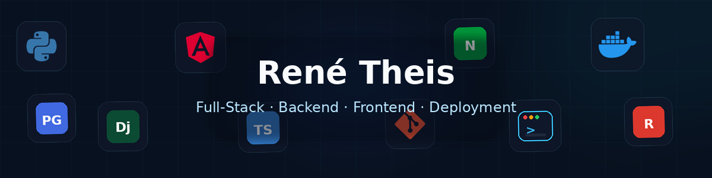
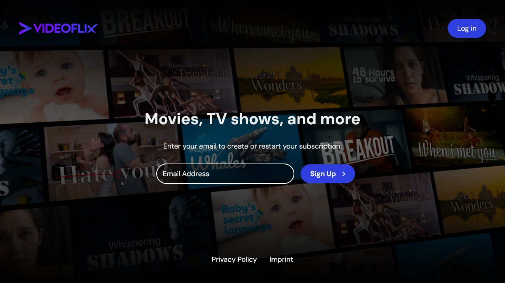
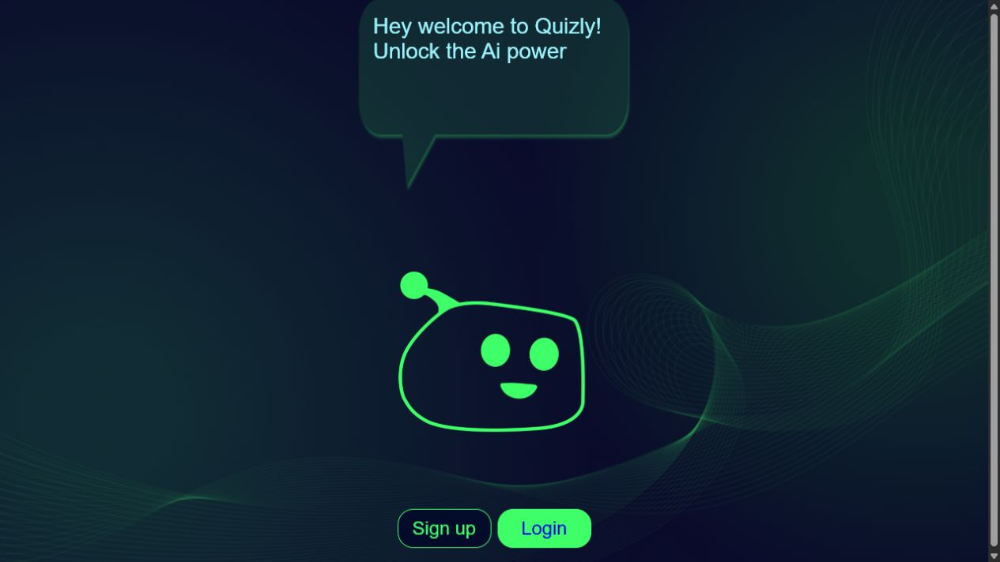
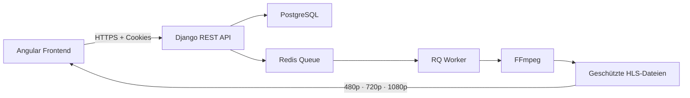
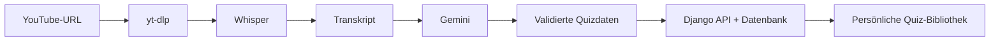
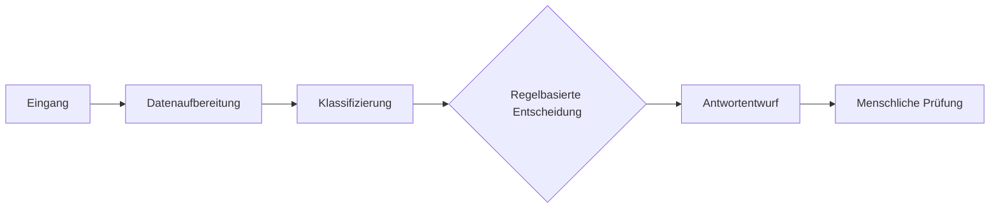

  <picture>
    <source srcset="./assets/tech-stack-header.webp" type="image/webp" />
    
  </picture>

  
  
  

---

## Über mich

> **Ich entwickle Anwendungen nicht nur bis `localhost`.**

Ich bin Full-Stack-Entwickler mit Schwerpunkt auf **Python, Django und REST-APIs im Backend** sowie **Angular und TypeScript im Frontend**.

Dabei interessiert mich der komplette Weg einer Anwendung: von Benutzeroberfläche und API über Datenbank und Hintergrundprozesse bis zu **Docker, Linux, Nginx, HTTPS und produktivem Betrieb**.

Saubere Architektur, wartbarer Code und Lösungen mit echtem praktischem Nutzen stehen für mich im Vordergrund.

<table>
<tr>
<td width="25%" align="center"><strong>Backend</strong> Sichere REST-APIs und klare Domänenlogik</td>
<td width="25%" align="center"><strong>Frontend</strong> Reaktive Oberflächen mit Angular und TypeScript</td>
<td width="25%" align="center"><strong>Betrieb</strong> Docker, Linux, Nginx, HTTPS und Deployment</td>
<td width="25%" align="center"><strong>Automatisierung</strong> Nachvollziehbare Workflows mit APIs und KI</td>
</tr>
</table>

## Tech-Stack

  

  
  
  
  
  

---

## Ausgewählte Projekte

Die folgenden Projekte zeigen vollständige technische Abläufe – von der Benutzeroberfläche über API und Datenverarbeitung bis zum produktiven Betrieb.

<table>
<tr>
<td width="50%" valign="top">

<h3 align="center">Videoflix</h3>

<strong>Sichere Streaming-Plattform mit automatisierter Video-Pipeline</strong>

Videos werden serverseitig verarbeitet und anschließend als geschützte adaptive HLS-Streams ausgeliefert.

<ul>
  <li><strong>Problem:</strong> Große Quelldateien sicher verarbeiten und in mehreren Qualitätsstufen bereitstellen.</li>
  <li><strong>Lösung:</strong> FFmpeg-Pipeline mit Redis, Django RQ und geschützter HLS-Auslieferung.</li>
  <li><strong>Ergebnis:</strong> Automatische 480p-, 720p- und 1080p-Varianten im produktiven Docker-Deployment.</li>
</ul>

  
  
  

</td>
<td width="50%" valign="top">

<h3 align="center">Quizly</h3>

<strong>KI-gestützte Quiz-Generierung aus YouTube-Inhalten</strong>

Aus einer YouTube-URL entsteht automatisch ein validiertes Quiz mit zehn Fragen und benutzerbezogener Verwaltung.

<ul>
  <li><strong>Problem:</strong> Lange Videoinhalte in interaktives Lernmaterial überführen.</li>
  <li><strong>Lösung:</strong> yt-dlp, Whisper-Transkription und strukturierte Generierung mit Gemini.</li>
  <li><strong>Ergebnis:</strong> Durchgängiger Ablauf von der URL bis zum gespeicherten und bearbeitbaren Quiz.</li>
</ul>

  
  

</td>
</tr>
</table>

<strong>Videoflix-Architektur anzeigen</strong>

<strong>Quizly-Generierungsablauf anzeigen</strong>

### Weitere Projekte

| Projekt | Technischer Schwerpunkt | Code |
| --- | --- | --- |
| **Coderr** | Rollenbasierter Service-Marktplatz mit Angeboten, Bestellungen, Bewertungen, Suche und Pagination | [Backend](https://github.com/DrPinselbecher/Coderr_Backend) · [Frontend](https://github.com/DrPinselbecher/Coderr_Frontend) |
| **KanMind** | Board- und Aufgabenverwaltung mit Owner-, Member-, Assignee- und Reviewer-Berechtigungen | [Backend](https://github.com/DrPinselbecher/KanMind_Backend_first_backend) · [Frontend](https://github.com/DrPinselbecher/KanMind_Frontend) |
| **DABubble** | Realtime-Kommunikation mit Angular, Firebase, Channels, Direktnachrichten und Threads | [Repository](https://github.com/DrPinselbecher/DABubble) |
| **Portfolio 2.0** | Angular-Portfolio mit interaktiver Projekt-Helix und produktivem Deployment | [Repository](https://github.com/DrPinselbecher/portfolio_2.0) · [Live](https://rene-theis.de) |

---

## Automatisierung & KI

Ich entwickle mit **n8n, APIs und KI-Modellen** nachvollziehbare Automatisierungen – unter anderem für E-Mail-Klassifizierung und intelligente Antwortvorbereitung. Kritische Entscheidungen bleiben dabei kontrollierbar und enden bewusst in einer menschlichen Prüfung.

---

## Technik trifft Praxiserfahrung

Vor meinem Einstieg in die Softwareentwicklung habe ich in operativen Positionen mit Führungsverantwortung gearbeitet. Diese Erfahrung prägt meine technische Arbeit: **Abläufe verstehen, Anforderungen strukturieren, Verantwortung übernehmen und Lösungen entwickeln, die im Alltag funktionieren.**

---

## Engineering-Qualität

<table>
<tr>
<td width="25%" align="center"><strong>Sicherheit</strong> HttpOnly-Cookies, Token-Blacklists und präzise Berechtigungen</td>
<td width="25%" align="center"><strong>Testbarkeit</strong> Automatisierte Tests und klare Validierung</td>
<td width="25%" align="center"><strong>Wartbarkeit</strong> Definierte API-Verträge und getrennte Verantwortlichkeiten</td>
<td width="25%" align="center"><strong>Betrieb</strong> Docker, Gunicorn, Nginx und HTTPS</td>
</tr>
</table>

Mein aktueller Entwicklungsschwerpunkt verbindet **Full-Stack-Engineering, DevOps und schrittweise DevSecOps-Praktiken**.

---

## GitHub-Aktivität

  <picture>
    <source
      media="(prefers-color-scheme: dark)"
      srcset="https://raw.githubusercontent.com/DrPinselbecher/DrPinselbecher/output/github-contribution-grid-snake-dark.svg"
    />
    <source
      media="(prefers-color-scheme: light)"
      srcset="https://raw.githubusercontent.com/DrPinselbecher/DrPinselbecher/output/github-contribution-grid-snake.svg"
    />
    
  </picture>

---

## Kontakt

  <strong>Interesse an Full-Stack-, Backend- oder Softwareentwicklungsprojekten?</strong> 
  Schreib mir direkt oder sieh dir weitere Arbeiten in meinem Portfolio an.

  
  
  

  

